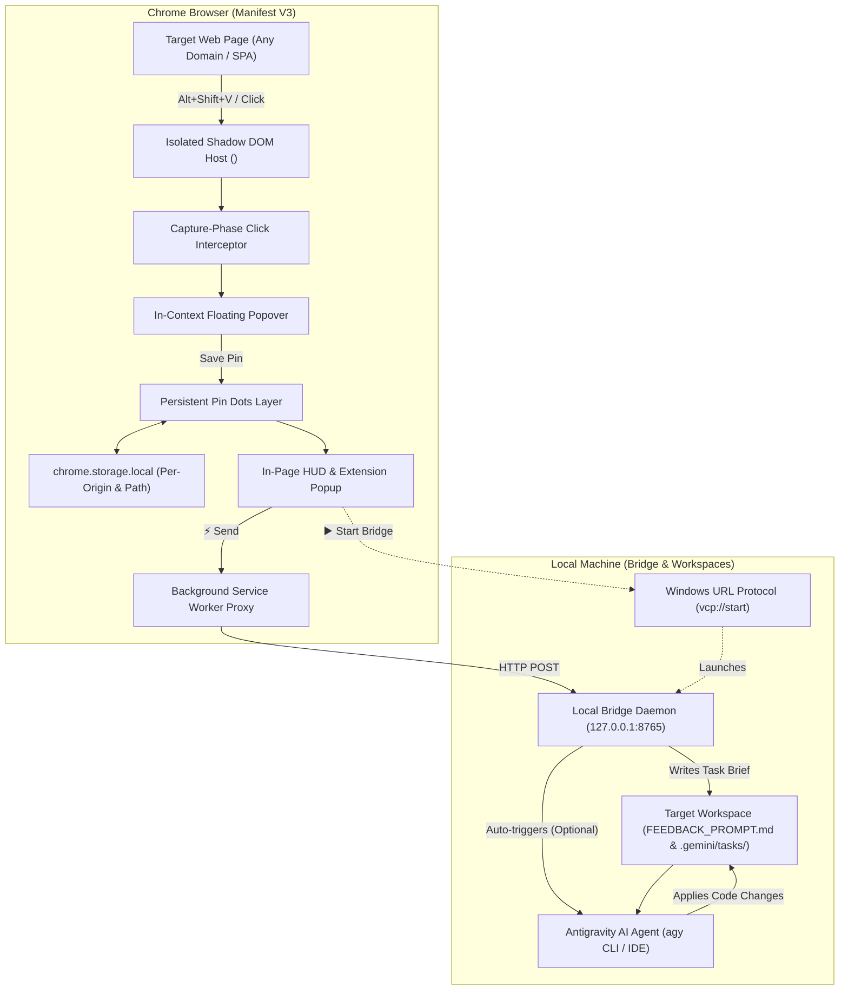

# Visual Click Prompt (VCP) — Interactive In-Context Web Prompting for AI Agents

<div align="center">

[](https://developer.chrome.com/docs/extensions/mv3/intro/)
[](LICENSE)
[](https://nodejs.org)
[](https://antigravity.google)
[](CONTRIBUTING.md)

**Point and click on any element on any live website, write in-context prompts right at your cursor, navigate freely across pages with persistent glowing pins, and dispatch structured task briefs directly into your local Antigravity AI agent.**

[Quickstart](#quickstart) • [Why VCP?](#why-visual-click-prompt) • [Key Features](#key-features) • [Architecture](#architecture--data-flow) • [Comparison](#comparison-with-alternatives) • [Agent Integration](#how-ai-agents-execute-vcp-tasks) • [FAQ](#frequently-asked-questions-faq)

</div>

---

> **Visual Click Prompt (VCP)** is an open-source visual in-context prompting Chrome Extension (Manifest V3) and local bridge daemon for modern web development that turns any live website into an interactive prompt canvas, capturing multi-page persistent annotations and dispatching structured task briefs directly into Antigravity AI agents with zero host CSS interference.

---

## Table of Contents
- [Table of Contents](#table-of-contents)
- [Why Visual Click Prompt?](#why-visual-click-prompt)
- [Key Features](#key-features)
- [Quickstart](#quickstart)
  - [1. Install the Chrome Extension](#1-install-the-chrome-extension)
  - [2. Start the Local Bridge Daemon](#2-start-the-local-bridge-daemon)
  - [3. Register the 1-Click Protocol (Optional Windows)](#3-register-the-1-click-protocol-optional-windows)
- [How to Use VCP](#how-to-use-vcp)
  - [Point, Click & Prompt](#point-click--prompt)
  - [Persistent Numbered Pins & Multi-Page Navigation](#persistent-numbered-pins--multi-page-navigation)
  - [Dispatching to Antigravity](#dispatching-to-antigravity)
- [How AI Agents Execute VCP Tasks](#how-ai-agents-execute-vcp-tasks)
  - [3 Execution Workflows](#3-execution-workflows)
  - [Task Brief Artifacts](#task-brief-artifacts)
- [Comparison with Alternatives](#comparison-with-alternatives)
- [Architecture & Data Flow](#architecture--data-flow)
- [Frequently Asked Questions (FAQ)](#frequently-asked-questions-faq)
- [Roadmap (V2)](#roadmap-v2)
- [Contributing](#contributing)
- [License](#license)

---

## Why Visual Click Prompt?

When reviewing a live website or local web app with an AI coding assistant like Antigravity, developers encounter constant friction:

```
❌ Traditional Workflow:
Live Website ➔ Inspect Element ➔ Copy Class/XPath ➔ Switch to IDE ➔ Type Prompt ➔ Repeat for 10 elements
(Disjointed context, lost visual coordinates, broken focus)

✨ The VCP Workflow:
Point & Click on Element ➔ Type Prompt in Floating Popover ➔ Browse Pages (Pins Persist) ➔ ⚡ 1-Click Send
(Autonomous agent execution, zero context switching, exact DOM anchors)
```

| Friction Point | Traditional Approach | Visual Click Prompt (VCP) |
| :--- | :--- | :--- |
| **Context Switching** | Alt-tabbing between browser and IDE for every single UI tweak | Stay on the website; point and prompt in real time |
| **Selector Guesswork** | Manually inspecting elements to describe components to LLMs | Automatically extracts TestIDs, cleaned CSS selectors, XPath, and text quotes |
| **Multi-Page Workflows** | Taking manual notes across multiple pages and views | Pins persist per domain and route across client-side SPA navigations |
| **Host CSS Collisions** | DevTools overlays distorting layout or leaking styles | 100% isolated Shadow DOM with strict `all: initial` CSS resets |
| **Agent Handoff** | Manually typing instructions into AI chat | Writes structured Markdown & JSON briefs directly to `<project>/.gemini/tasks/` |

---

## Key Features

- **Isolated Shadow DOM Overlay (`<vcp-feedback-root>`)**: Mounts directly to `document.documentElement` with `all: initial` isolation. Host site styles cannot warp extension controls, and extension styles never leak into the host page.
- **CSP-Proof Inlined Stylesheet**: Bypasses strict Content Security Policies (`connect-src`, `style-src`) that break external CSS fetches on enterprise or banking websites.
- **Precision In-Context Popover**: Floats directly at the clicked coordinates `(clientX, clientY)` with automatic viewport boundary flipping (`top`/`bottom`, `left`/`right`) so it never clips off-screen.
- **Persistent Glowing Numbered Dots**: Leaves an illuminated, pulsing numbered dot (`1`, `2`, `3`...) anchored to the exact clicked spot. Stays glued to elements across scrolling and window resizing.
- **Multi-Page Persistence Engine**: Pins are stored in `chrome.storage.local` partitioned by domain and normalized route path. Navigate across pages or SPA routes without losing annotations; returning to any page automatically re-hydrates its pins.
- **Resilient Multi-Tier Element Anchoring**:
  - `data-testid`, `data-cy`, `data-qa` high-confidence hooks
  - Framework-clean CSS selectors (filters out dynamic hashes like `sc-...`, `css-...`, `:r...:`)
  - W3C Text Quote Anchors (exact snippet, prefix, suffix)
  - Structural XPath fallback
  - Normalized geometric ratios (`relativeX`, `relativeY`) and computed style snapshots
- **Multi-Project Workspace Switcher**: Seamlessly target any local project directory (e.g. `C:\prj\vcp`, `C:\prj\my-app`, or any custom workspace).
- **Autonomous Agent Auto-Triggering**: Built-in support for the Antigravity CLI (`agy`). When enabled, the bridge server automatically launches headless agent execution with `--dangerously-skip-permissions` to implement changes hands-free.
- **1-Click Bridge Protocol (`vcp://start`)**: Click **▶️ Start Bridge** directly inside the extension popup or in-page modal to launch the local bridge daemon via native Windows URL protocol registration.
- **Fail-Safe Clipboard Fallback**: If the bridge daemon is ever offline, clicking Send automatically copies the complete Markdown task brief to your clipboard so you can paste it directly into Antigravity chat.

---

## Quickstart

### 1. Install the Chrome Extension
1. Clone or download this repository:
   ```bash
   git clone https://github.com/shatinz/vcp.git C:\prj\vcp
   ```
2. Open Google Chrome and navigate to `chrome://extensions`.
3. Enable **Developer mode** using the toggle switch in the top-right corner.
4. Click **Load unpacked** and select the `extension` directory:
   ```text
   C:\prj\vcp\extension
   ```
5. Pin **Visual Click Prompt (VCP)** to your Chrome toolbar.

### 2. Start the Local Bridge Daemon
The bridge daemon receives feedback payloads from the extension and writes structured task briefs directly into your local project workspace.

**Option A: 1-Click Launch (Windows)**
- Double-click `start-bridge.bat` in `C:\prj\vcp`.

**Option B: Terminal (Any OS)**
```bash
cd C:\prj\vcp\bridge
node server.js
```
*The bridge runs at `http://127.0.0.1:8765` with zero external npm dependencies.*

### 3. Register the 1-Click Protocol (Optional Windows)
To enable the **▶️ Start Bridge** button inside the extension:
- Run `register-protocol.bat` as Administrator (or standard user) once:
  ```cmd
  C:\prj\vcp\register-protocol.bat
  ```
This registers the `vcp://` protocol handler in Windows Registry so clicking Start in Chrome launches the bridge daemon automatically.

---

## How to Use VCP

### Point, Click & Prompt
1. On any webpage, activate **Pin Mode**:
   - Press `Alt+Shift+V`
   - Or click **Pin Mode: ON** in the floating bottom-right HUD
   - Or open the extension popup and click **Turn ON Pin Mode**
2. Hover over any element (button, heading, container, card). A dashed indigo highlight box outlines the element with its tag name.
3. **Click the element**. A floating card appears right at your cursor:
   - Type your instruction (e.g. *"Change button color to navy and increase padding to 16px"*).
   - Click quick category chips (`Style`, `Copy`, `Layout`, `Bug`, `UX`).
   - Click **Save Pin** (or hit `Ctrl+Enter`).

### Persistent Numbered Pins & Multi-Page Navigation
- A glowing numbered dot remains anchored to that exact spot.
- Navigate to other pages or SPA routes—your pins are saved in local storage.
- When you return to any previously annotated page, all pins automatically re-anchor to their elements.
- Click any dot on the page to view, edit, or delete its prompt.

### Dispatching to Antigravity
You can send your collected prompts using either:
1. **In-Page Dispatch Modal:** Click **⚡ Send** on the floating bottom-right HUD to review all pins on the page and dispatch directly without opening the toolbar popup.
2. **Toolbar Popup:** Click the VCP extension icon in Chrome to filter pins between "Current Page" and "All Pages", enter a macro prompt, select your target project workspace, and click **⚡ Send to Antigravity**.

---

## How AI Agents Execute VCP Tasks

When you dispatch feedback, the bridge daemon generates rich, structured prompt briefs in your project workspace:

### 3 Execution Workflows

#### 1. Autonomous Auto-Trigger (Zero-Click Execution) 🤖
- Enable the **`[✓] Auto-trigger Agent`** checkbox in the VCP popup or in-page modal.
- When you click Send, the bridge daemon immediately spawns `agy.exe` in the background with auto-approved permissions (`--dangerously-skip-permissions`).
- The agent reads `FEEDBACK_PROMPT.md`, locates components, writes code changes directly to disk, and streams logs to `.gemini/tasks/agent-run-<timestamp>.log`.

#### 2. In-Session Watcher (Interactive Pair Programming) 💬
- In your active Antigravity chat session, say:
  > *"Antigravity, start watching for visual feedback prompts."*
- Antigravity activates the `vcp` skill, monitors `FEEDBACK_PROMPT.md`, and automatically executes new tasks as soon as you save pins on your live website.

#### 3. On-Demand Prompt ⚡
- In Antigravity chat, simply type:
  > `Implement FEEDBACK_PROMPT.md`
  or
  > `/goal Implement the visual tasks in FEEDBACK_PROMPT.md`

### Task Brief Artifacts

Every dispatch produces:
- `<workspace>/FEEDBACK_PROMPT.md`: Primary active task document at the project root.
- `<workspace>/.gemini/tasks/task-<timestamp>.md`: Historical timestamped task brief.
- `<workspace>/.gemini/tasks/feedback-<timestamp>.json`: Machine-readable payload containing geometric coordinates and DOM trees.
- `<workspace>/agent_inbox.md`: Append-only feedback log.

```markdown
# 🎯 Visual Click Prompt — In-Context Task Brief
> **Target Page:** https://myshop.dev/products/shoes (/products/shoes)
> **Project Workspace:** C:\prj\my-app
> **Total Annotated Elements:** 2

## 📢 Macro / Overall Directive
> Ensure all changes maintain mobile responsiveness and use Tailwind v4 tokens.

## 📌 Element Modification Details

### Pin #1: `<button>`
- **User Instruction / Prompt:** Change button background to #059669 and increase font size to 18px.
- **Selector:** `main > div.product-card > button.btn-primary`
- **Identifier (TestID/ID):** `add-to-cart-btn`
- **Text Context:** "Add to Cart - $99"
- **Computed Styles:** `color: rgb(255, 255, 255); bg: rgb(59, 130, 246); font: 14px (600); display: flex`

```html
<button data-testid="add-to-cart-btn" class="btn-primary">Add to Cart - $99</button>
```
```

---

## Comparison with Alternatives

| Feature / Metric | VCP (This Project) | Jam.dev | Onlook | Manual DevTools |
| :--- | :--- | :--- | :--- | :--- |
| **Local Antigravity AI Bridge** | ✅ Native Zero-Latency Bridge | ❌ Cloud SaaS / Webhook | ❌ Next.js specific | ❌ None |
| **Multi-Page Persistence** | ✅ Per-route `chrome.storage` | ⚠️ Single-page session | ❌ Local editor only | ❌ Wiped on reload |
| **Zero Dependencies Bridge** | ✅ Pure Node.js built-in HTTP | ❌ Requires Cloud Account | ❌ Large Electron App | N/A |
| **Host DOM Isolation** | ✅ Open Shadow DOM + Inlined CSS | ⚠️ Content Script CSS | ⚠️ Code Instrumentation | ❌ Modifies Host DOM |
| **Autonomous CLI Triggering** | ✅ Native `agy` auto-spawn | ❌ Manual prompt copying | ⚠️ Internal AI only | ❌ Manual |
| **License** | **MIT (Open Source)** | Proprietary SaaS | Apache 2.0 | Built-in Browser |

---

## Architecture & Data Flow



---

## Frequently Asked Questions (FAQ)

### Does VCP work on SPAs built with React, Vue, Next.js, or Svelte?
**Yes.** VCP includes monkey-patched History API listeners (`pushState`, `replaceState`, `popstate`) and Chrome `webNavigation` event handlers. Pins automatically re-anchor when navigating across client-side routes, and asynchronous component rendering is caught via an internal `MutationObserver`.

### Why does VCP use an isolated Shadow DOM?
Modern web applications use aggressive CSS resets, CSS Modules, or global stylesheets that often break extension interfaces. By mounting `<vcp-feedback-root>` to `document.documentElement` with `all: initial` and inlined CSS, VCP guarantees zero style leakage in both directions.

### Can VCP connect to multiple projects on my machine?
**Yes.** The extension popup and in-page modal feature a **Target Project Workspace** selector. You can switch between `C:\prj\vcp`, `C:\prj\my-app`, or any other directory at any time, and recent projects are saved for 1-click access.

### What happens if the bridge server is offline when I click Send?
VCP has an automatic **Fail-Safe Clipboard Fallback**. If the bridge cannot be reached, the complete formatted Markdown prompt brief is instantly copied to your system clipboard, allowing you to paste it directly into your Antigravity chat window with zero lost work.

---

## Roadmap (V2)

- [ ] **Vector Canvas Overlay:** Freehand pen drawing, arrows, and rectangle callouts powered by SVG and `perfect-freehand`.
- [ ] **Element Screenshot Crop:** Automatic high-resolution screenshot tile captures of annotated elements attached directly to task briefs.
- [ ] **Bi-Directional Agent State Sync:** Visual indicators on pin markers showing when Antigravity has started, implemented, or verified a task.

---

## Contributing

Contributions are welcome! Please feel free to submit a Pull Request or open an Issue.

1. Fork the repository
2. Create your feature branch (`git checkout -b feature/v2-drawing`)
3. Commit your changes (`git commit -m 'feat: add SVG drawing layer'`)
4. Push to the branch (`git push origin feature/v2-drawing`)
5. Open a Pull Request

---

## License

This project is licensed under the **MIT License** — see the [LICENSE](LICENSE) file for details.
