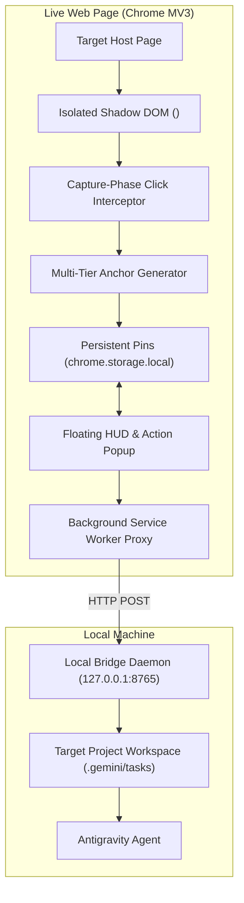

# 🎯 Visual Click Prompt (VCP)

> **Interactive visual in-context prompting for live websites with multi-page persistent pins and a direct bridge to Antigravity agents.**

Point and click on any element on your live website, write your prompt in a popover directly at the clicked spot, navigate between pages without losing your pins, and dispatch structured task briefs straight to your Antigravity agent in any project workspace.

---

## ⚡ Quick Start Guide

### Step 1: Install the Chrome Extension
1. Open Google Chrome and navigate to `chrome://extensions`.
2. Enable **Developer mode** (toggle in the top-right corner).
3. Click **Load unpacked**.
4. Select the `extension` folder inside this repository:
   ```text
   C:\prj\vcp\extension
   ```
5. Pin the **Visual Click Prompt (VCP)** icon to your Chrome toolbar.

---

### Step 2: Start the Antigravity Local Bridge Daemon
The bridge daemon receives feedback payloads from the extension and writes structured task briefs directly to your Antigravity workspace.

**Option A: 1-Click Launch (Windows)**
- Double-click `start-bridge.bat` in `C:\prj\vcp`.

**Option B: Terminal**
```bash
cd C:\prj\vcp\bridge
node server.js
```
The bridge runs at `http://127.0.0.1:8765`.

---

## 🚀 How to Use

### 1. Toggle Pin Mode
* **Shortcut:** Press `Alt+Shift+V` on any webpage.
* **Or:** Click the floating **VCP HUD** docked at the bottom-right of the screen and click **Pin Mode: ON**.
* **Or:** Open the extension popup from your toolbar and click **Turn ON Pin Mode**.

### 2. Point, Click & Prompt
* Hover over any button, headline, image, or container. You will see an isolated highlight box with the element's tag.
* **Click the element**. A sleek in-context popover will appear right at the clicked coordinate.
* Type your instruction (e.g. *"Change button color to navy and increase padding"*).
* Click quick tag chips (`Style`, `Copy`, `Layout`, `Bug`, `UX`) to categorize your prompt.
* Click **Save Pin** (or hit Enter). A numbered pin marker (e.g. `1`, `2`, `3`...) is created and anchored to the element.

### 3. Multi-Page Browsing & Persistence
* Browse freely across different pages or SPA routes of the website.
* Your pins are automatically persisted in `chrome.storage.local` per domain and normalized route.
* When you return to any page, your pins automatically re-anchor to their respective elements.
* Click any pin marker to view, edit, or delete it.

### 4. Review & Add Macro Instructions
* Open the **VCP Extension Popup**:
  * **Current Page vs. All Pages Tabs:** Filter and inspect all pins collected.
  * **Jump to Element:** Click "Jump to Element" to automatically scroll to and highlight that element on the page.
  * **Macro Prompt:** Add an overarching directive for the agent (e.g. *"Ensure all changes follow mobile-first responsive design and use Tailwind v4"*).

### 5. Select Workspace & Send to Antigravity
* In the popup, verify or change the **Target Antigravity Project** (e.g. `C:\prj\vcp`, `C:\prj\pdf-anki-sync`, or any other directory).
* Click **⚡ Send to Antigravity**.
* The bridge instantly generates:
  1. `<target_project>/FEEDBACK_PROMPT.md` (active project root brief)
  2. `<target_project>/.gemini/tasks/task-<timestamp>.md` (timestamped task document)
  3. `<target_project>/.gemini/tasks/feedback-<timestamp>.json` (machine-readable data)
  4. Appends task summary to `<target_project>/agent_inbox.md`

---

## 🤖 How to Trigger the Agent to Implement the Changes

You have **3 flexible ways** to trigger Antigravity:

### Method 1: Autonomous Auto-Trigger (Zero-Click Execution)
* Check the **"🤖 Auto-trigger Agent"** checkbox in the VCP extension popup.
* When you click **⚡ Send to Antigravity**, the bridge daemon automatically spawns the **Antigravity CLI (`agy`)** in the background with `--dangerously-skip-permissions` targeting that project directory.
* The agent reads `FEEDBACK_PROMPT.md`, locates your components, implements the requested changes, and writes execution logs to `.gemini/tasks/agent-run-<timestamp>.log` — **completely hands-free without opening any chat!**

### Method 2: In-Session Watcher (Continuous Pair Programming)
* If you have an active chat session with Antigravity (in the IDE or desktop app), simply say:
  > *"Antigravity, start watching for visual feedback prompts."*
* Antigravity will monitor `FEEDBACK_PROMPT.md` and `.gemini/tasks/`. Every time you save pins on your live website, Antigravity wakes up automatically, implements the changes, and presents the diffs right in the conversation.

### Method 3: Direct Prompt / 1-Click Interactive Trigger
* In your Antigravity chat window, simply prompt:
  > `Implement FEEDBACK_PROMPT.md`
  or
  > `/goal Implement the visual tasks in FEEDBACK_PROMPT.md`
* Antigravity will load the exact selectors, computed styles, text quotes, and instructions, and apply the code edits step-by-step.

---

## 🏗️ Architecture Highlights



1. **Zero Host Page Leakage (Isolated Shadow DOM)**:
   All UI elements (highlight box, pins, popovers, HUD) are rendered inside an open Shadow Root attached to `document.documentElement` with `all: initial`. Host CSS cannot alter extension styles, and extension styles cannot break host websites.
2. **Resilient Multi-Tier Anchoring**:
   Pins survive dynamic rendering and SPAs by combining:
   - Test IDs (`data-testid`, `data-cy`, `data-qa`)
   - Cleaned IDs & CSS selectors (filtering framework hash tokens)
   - W3C Text Quotes (exact, prefix, suffix)
   - Structural XPath
   - Normalized geometric ratios
   - SPA `MutationObserver` re-anchoring
3. **PNA & Mixed-Content Bypass**:
   Remote `https://` websites are blocked by Chrome security from directly fetching `http://localhost`. VCP routes all network calls through the Background Service Worker (`background.js`), ensuring frictionless local delivery.
4. **V2 Drawing Layer Ready**:
   Includes an SVG vector layer (`drawing-layer.js`) positioned inside the Shadow DOM layer cake, prepared for freehand and shape annotations in V2.

---

## 🧪 Testing & Verification

Run automated bridge tests:
```bash
cd C:\prj\vcp\bridge
node test-bridge.js
```
